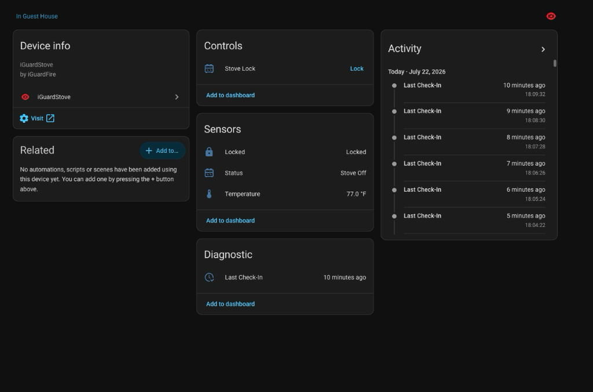

<p align="center">
  
</p>

# iGuardStove for Home Assistant

[](https://github.com/andrewtryder/ha-iguardstove/releases)
[](https://github.com/hacs/integration)
[](LICENSE)

Bring your [iGuardStove / iGuardFire](https://www.iguardstove.com) devices into Home Assistant — see stove status on your dashboard, get alerts when something happens, and lock the stove remotely when you need to.

- **Status on your dashboard** — stove state, temperature, and last check-in at a glance
- **Instant alerts** — motion, shutoff, night lock, and other activity as Home Assistant events
- **One-click automations** — import ready-made blueprints; no YAML required
- **Auto-discovery** — every stove on your iGuardFire account shows up automatically



*Example: stove status, temperature, and activity entities on a Home Assistant dashboard.*

## Contents

- [Safety warning](#important-safety-warning)
- [What you get](#what-you-get)
- [Activity events](#activity-events)
- [Automation blueprints](#automation-blueprints)
- [Prerequisites](#prerequisites)
- [Installation](#installation)
- [Configuration](#configuration)
- [How it works](#how-it-works)
- [Removing the integration](#removing-the-integration)
- [Project info](#project-info)

---

> [!WARNING]
> ### Important Safety Warning
> This integration can remotely control physical stove lockout hardware.
> - **Accidental remote activation**: Automating stove lock/unlock with voice assistants (Alexa, Google Assistant, Siri) or other automations carries inherent safety risks.
> - **Disabled by default**: To reduce accidental use, the entity that can lock/unlock your stove (**Stove Lock**) starts **disabled**. To use remote control, enable it under **Settings → Devices & Services → Entities → Stove Lock → Enable**.
> - **Separate remote-unlock permission**: Enabling the entity allows remote locking. For safety, **Remote Unlock** stays off by default. To allow unlocking, turn on **Allow remote disengagement of stove lockout (Remote Unlock)** under **Settings → Devices & Services → iGuardStove → Configure**.

---

## What you get

| Feature | Description |
|---|---|
| **Status** | Human-readable stove status (e.g. "Stove Off", "Night Lock") |
| **Last Check-In** | How long since the device last contacted the portal (e.g. "24 minutes ago") |
| **Temperature** | Ambient temperature from the unit (°F or °C per device settings) |
| **Fires Prevented** | Total shutoff events recorded by the stove |
| **Stove Lock** | Remote lock/unlock from Home Assistant (opt-in; unlock needs a separate setting) |
| **Activity** | Portal activity events you can use for notifications and automations |

All stoves on your account are discovered at setup. New stoves are picked up automatically in the background.

---

## Activity events

Build notifications and automations from real stove activity — for example when motion is detected, night lock changes, or the stove shuts off.

Supported events include:

- Motion Detected (Activity Seen)
- Night Lock On / Off
- Stove Turned On / Off
- Motion Auto Resumed
- Auto Shut Off
- Emergency Button Pressed
- Temperature Alert
- Lost Communication
- iGuardStove Bypassed
- No Activity During Grace Period

<details>
<summary>Technical details (for contributors)</summary>

Event parsing, deduplication, timezone handling, and persistence are documented in [docs/ARCHITECTURE.md](docs/ARCHITECTURE.md).

</details>

---

## Automation blueprints

A **blueprint** is a pre-built automation you can import with one click — no YAML or coding required.

### Included blueprints

1. **iGuardStove - Event Action Runner**: Trigger custom actions (notifications, lights, sirens, TTS, or scripts) when selected iGuardStove events occur.
   [](https://my.home-assistant.io/redirect/blueprint_import/?blueprint_url=https%3A%2F%2Fgithub.com%2Fandrewtryder%2Fha-iguardstove%2Fblob%2Fmain%2Fblueprints%2Fautomation%2Figuardstove%2Fselected_event_actions.yaml)

2. **iGuardStove - Stove Safety Notification**: Guided mobile safety alerts with customizable titles and optional critical notification sounds (can bypass silent mode on supported devices).
   [](https://my.home-assistant.io/redirect/blueprint_import/?blueprint_url=https%3A%2F%2Fgithub.com%2Fandrewtryder%2Fha-iguardstove%2Fblob%2Fmain%2Fblueprints%2Fautomation%2Figuardstove%2Fsafety_notification.yaml)

### Blueprint safety principles

To preserve the safety model of iGuardStove:

- **No automatic unlocking**: These blueprints only run notifications and actions. They will **never** unlock the stove (e.g. via presence, schedules, or voice).
- **Manual lock opt-in**: The lock entity remains disabled by default until you enable it.

---

## Prerequisites

- An active iGuardFire account
- At least one iGuardStove visible in the iGuardFire management portal
- Home Assistant 2026.3.0 or newer
- Internet access from Home Assistant to `manage.iguardfire.com`

> [!NOTE]
> This works by securely signing into the same iGuardFire website you already use — iGuardFire doesn't currently offer a public API for smart home tools.

---

## Installation

### Via HACS (recommended)

[](https://my.home-assistant.io/redirect/hacs_repository/?owner=andrewtryder&repository=ha-iguardstove&category=integration)

1. Click the badge above (or add `https://github.com/andrewtryder/ha-iguardstove` as a custom repository in HACS → **Integrations**)
2. Install **iGuardStove** from HACS
3. Restart Home Assistant

<details>
<summary>Advanced: manual installation</summary>

1. Copy the `custom_components/iguardstove` folder into your `<config>/custom_components/` directory
2. Restart Home Assistant

</details>

---

## Configuration

1. Go to **Settings → Devices & Services → Add Integration**
2. Search for **iGuardStove**
3. Enter your **iGuardFire account email and password**
4. All stoves on the account are discovered and set up automatically

No YAML configuration is needed.

---

## How it works

The integration periodically signs into the iGuardFire portal on your behalf, reads each stove's status page, and updates Home Assistant. New stoves on your account are found automatically.

### Entities per device

```
sensor.guest_house_stove_status
sensor.guest_house_stove_last_check_in
sensor.guest_house_stove_temperature
sensor.guest_house_stove_fires_prevented
lock.guest_house_stove_stove_lock (disabled by default)
event.guest_house_stove_activity
```

For polling intervals, authentication, scraping, and other internals, see [docs/ARCHITECTURE.md](docs/ARCHITECTURE.md).

Coming from the older multiscrape blueprint? See [docs/MIGRATION.md](docs/MIGRATION.md).

---

## Removing the integration

1. Open **Settings → Devices & services**.
2. Select **iGuardStove**.
3. Open the integration menu and select **Delete**.
4. If installed manually, remove `custom_components/iguardstove`.
5. Restart Home Assistant after removing a manual installation.

Removing the integration does not modify the iGuardFire account, portal settings, schedules, or physical stove configuration.

---

## Project info

- **Security** — See [SECURITY.md](SECURITY.md) for vulnerability reporting and credential storage.
- **Contributing** — See [CONTRIBUTING.md](CONTRIBUTING.md). [](https://github.com/andrewtryder/ha-iguardstove/actions/workflows/tests.yml)
- **Architecture** — [docs/ARCHITECTURE.md](docs/ARCHITECTURE.md)
- **License** — [MIT](LICENSE)
